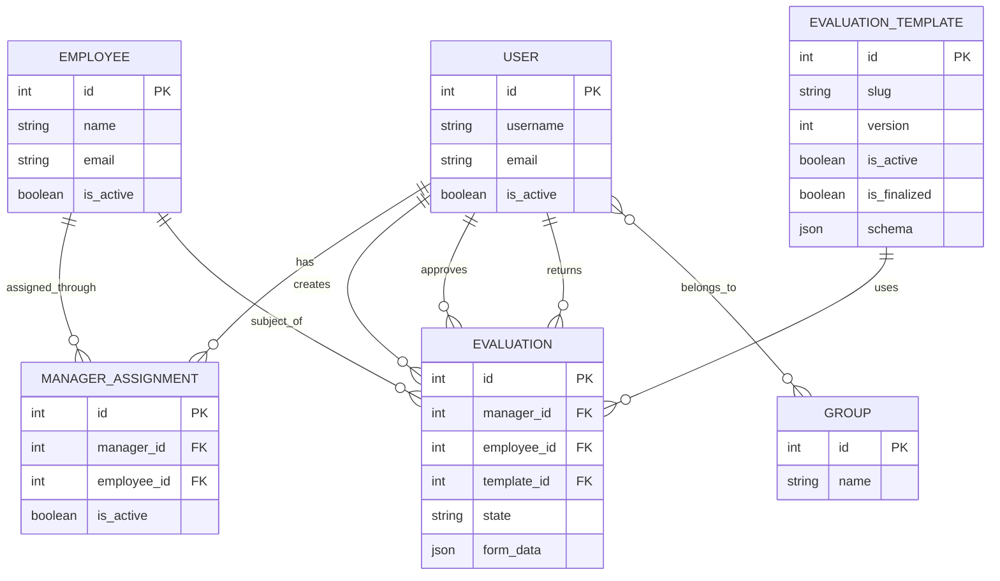

# HR Performance Evaluation Platform - Architecture

## Direction

Build a Dockerized, server-rendered Django monolith for managing co-op
performance evaluations. v1 uses one Django project app and SQLite.

Use Django ORM, templates, forms, auth, sessions, groups, permissions, and
migrations. Do not add React or a public REST API unless this document is
updated first.

## Application Boundaries

- Keep product code in the single `app` Django app.
- Keep authorization server-side in views, forms, querysets, and workflow
  helpers.
- Use services only when view/form logic becomes hard to follow.
- Django superusers are technical operators, not product Admin users.

## Roles

Business roles come from Django `Group` records: `VP`, `Manager`, and
`Employee`.

- `VP`: manages users and assignments; reviews, approves, and returns
  evaluations.
- `Manager`: creates and manages only their own evaluations for assigned
  Employees.
- `Employee`: evaluation subject only; no login in v1.

Each active product user must have exactly one business role.

## Data Model

Key rules:

- Removing an assignment prevents new evaluations but does not change existing
  evaluation ownership.
- Managers start evaluations only from active finalized templates.
- Templates are JSON-backed, versioned, and immutable once finalized except for
  activation state.
- Evaluations store answers as JSON keyed by the template schema.

## Workflow

Evaluation states are `Draft`, `In Review`, and `Approved`.

- Managers submit or unlock only their own evaluations.
- VPs approve or return only evaluations in review.
- Approved evaluations are final and read-only.
- Workflow changes must validate actor role, ownership, current state, and
  timestamps.

## Import And Export

- Markdown and PDF exports are available to users who can view the evaluation.
- Exports include all evaluation fields and do not change workflow state.
- JSON export is available to users who can view the evaluation.
- JSON import is Manager-only, creates a new `Draft`, requires an active
  assignment, validates schema, and never overwrites existing records.

Version the JSON import/export schema.

## Deployment

SQLite is the v1 database. Store it on durable mounted storage and run one app
instance while using SQLite.

Docker Compose owns the deployment path. The web container runs migrations on
startup, static files are collected at image build time, and production HTTPS
deployments must set secure session and CSRF cookie flags.

Use PostgreSQL if write contention, horizontal scaling, or managed availability
becomes necessary.
